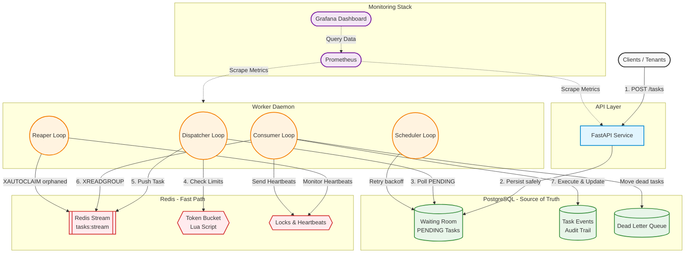

# Fairlane

**Fairlane** is a high-performance, fault-tolerant distributed task queue engineered specifically for B2B SaaS applications. It guarantees at-least-once execution semantics, strict tenant isolation via Weighted Fair Queuing (WFQ), high-performance API rate limiting, and automated crash recovery.

By combining the transactional safety of PostgreSQL with the extreme low-latency capabilities of Redis Streams, Fairlane achieves a hybrid architecture capable of absorbing massive traffic spikes without dropping a single task.

---

## High-Level Architecture

Fairlane decouples task ingestion, storage, fast-path coordination, and background processing into scalable layers.



---

## Key Features

- **Multi-Tenancy & Weighted Fair Queuing (WFQ)**: Prevents the "noisy neighbor" problem. If Tenant A floods the system with 10,000 tasks, Tenant B's tasks will still process concurrently without getting stuck at the back of the queue.
- **Atomic Rate Limiting**: Uses a custom Redis Lua script to enforce a strict Token Bucket algorithm per tenant, guaranteeing fair usage limits without race conditions.
- **Persistence First**: All tasks are persisted to PostgreSQL before an HTTP response is returned. Zero data loss even in the event of a total Redis failure.
- **Crash Recovery (The Reaper)**: Worker processes emit Redis heartbeats. If a worker container crashes or is OOM-killed, the singleton Reaper process detects the dead heartbeat, reclaims the orphaned tasks via `XAUTOCLAIM`, and automatically re-queues them.
- **Exponential Backoff & Dead Letter Queue (DLQ)**: Transient failures are caught and retried automatically with exponential backoff and jitter. Tasks that fail permanently (or crash the worker repeatedly) are safely quarantined to the DLQ.

---

## Quick Start (Docker Compose)

Fairlane is fully containerized. A single command will spin up the API, Worker, PostgreSQL, Redis, Prometheus, Grafana, and Adminer.

### 1. Start the stack
```bash
docker compose up --build
```

### 2. View Interactive API Docs (Swagger UI)
Once the containers are running, navigate to:
**[http://localhost:8000/docs](http://localhost:8000/docs)**

### 3. Generate Demo Traffic
To test the queue under load, open a new terminal and run the provided load generation script. This will inject 10 tasks per second for 120 seconds with a randomized 10% failure rate (to demonstrate exponential backoff):
```bash
python scripts/demo_load.py --rate 10 --duration 120
```

### 4. View Observability Dashboards
Fairlane comes with a pre-configured Grafana dashboard that automatically visualizes queue health, per-tenant throughput, latency, and rate-limiting.
- **Grafana Dashboard**: [http://localhost:3000](http://localhost:3000) (No login required)
- **Prometheus**: [http://localhost:9090](http://localhost:9090)

### 5. View Database (Adminer)
You can directly inspect the PostgreSQL tables (including the `tasks`, `task_events` audit trail, and `dead_letters`).
- **Adminer**: [http://localhost:8080](http://localhost:8080)
- **System**: PostgreSQL
- **Server**: `postgres`
- **Username**: `fairlane`
- **Password**: `fairlane_secret`
- **Database**: `fairlane`

---

## API Examples

### Submit a Task
```bash
curl -X POST http://localhost:8000/tasks \
  -H "Content-Type: application/json" \
  -d '{
    "tenant_id": "tenant-A",
    "task_type": "send_email",
    "payload": {
      "to": "user@example.com",
      "subject": "Hello World"
    },
    "priority": 5
  }'
```

### Check Task Status
```bash
curl http://localhost:8000/tasks/<task_id>
```

### Get Full Audit Timeline
```bash
curl http://localhost:8000/tasks/<task_id>/timeline
```

---

## Production Deployment
Fairlane includes a `render.yaml` Blueprint for zero-downtime deployments on Render. It provisions managed PostgreSQL and Redis instances alongside horizontally scalable API and Worker services.

```yaml
# deploy via render CLI or GitHub integration
```
