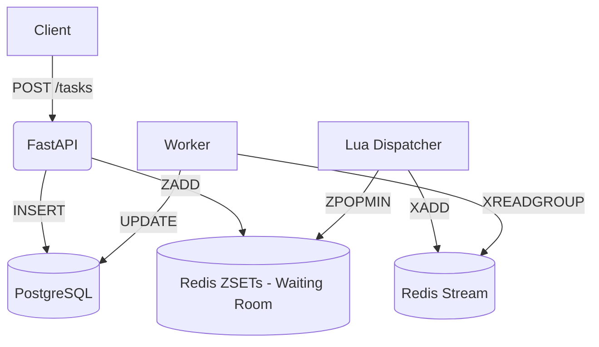

# Fairlane Architecture

## Overview
Fairlane is a distributed, multi-tenant task queue. 
It uses PostgreSQL as the source of truth and Redis for fast scheduling and signaling.

## Components
1. **API (FastAPI)**: Receives tasks, enforces limits, stores in Postgres, and enqueues to Redis.
2. **Workers (Python asyncio)**: Consume from a Redis Stream (`tasks:stream`), execute tasks, and update Postgres.
3. **Dispatcher (Background loop)**: Pulls tasks from per-tenant waiting rooms using a Lua script to enforce Weighted Fair Queuing (WFQ) and priority aging, moving them to the execution stream.
4. **Reaper**: Detects dead workers, reclaims their locked tasks, and reconciles lost submissions.
5. **PostgreSQL**: Stores tasks, events, and side-effects. Provides strong durability.
6. **Redis**: Sorted sets for tenant waiting rooms, streams for delivery, keys for worker heartbeats.

## Data Flow

